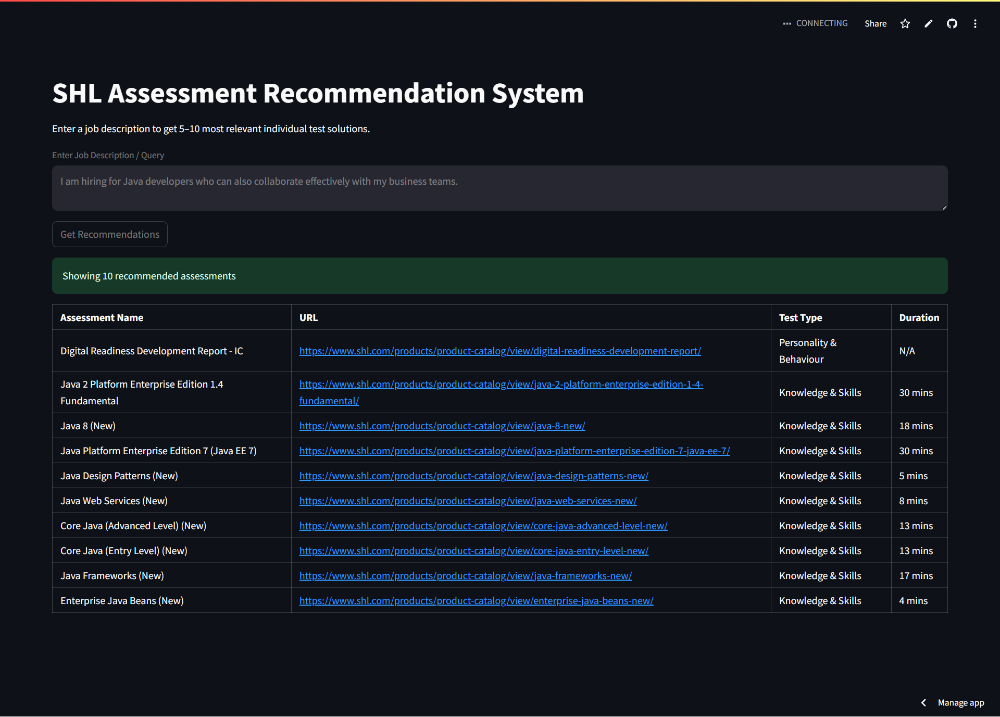

# 🎯 SHL Assessment Recommendation System

An intelligent, LLM-powered recommendation system that suggests the most relevant SHL individual assessments based on a natural language query or job description.

The system combines semantic search (ChromaDB + SentenceTransformers) with LLM-based reranking (Groq LLaMA-3) to deliver accurate and balanced recommendations across multiple assessment domains (Technical, Personality, Cognitive, etc.).

---

## 🌐 Live Applications

### 🔗 API Endpoint
- **FastAPI (Render Deployment):** https://shl-assessment-recommender-uovg.onrender.com/recommend
- **Swagger Documentation:** https://shl-assessment-recommender-uovg.onrender.com/docs

### 💻 Frontend Web Application
- **Streamlit Application:** [SHL Assessment Recommender](https://vaibhav-project-shl-assessment-recommender.streamlit.app/)

---

## 🛠 Key Features

- Web scraping of SHL assessment catalogue (377+ individual test solutions)  
- Clean & structured metadata storage (JSON)  
- Vector similarity search using ChromaDB  
- Embedding model: sentence-transformers/all-MiniLM-L6-v2  
- Intelligent test-type balancing (K, P, A, C domains)  
- LLM-based reranking using Groq LLaMA-3  
- Evaluation using Mean Recall@10  
- FastAPI production deployment  
- Streamlit frontend interface  
- Automated CSV submission generation  

---

## 📊 Performance

- **Mean Recall@10:** ≈ 0.32
- **Balanced recommendations** for multi-domain queries
- **Example:** "Java Developer who collaborates well" → Knowledge & Skills + Personality & Behavior assessments

---

## 📂 Project Structure

```
SHL-Assessment-Recommender/
├── chroma_db/                         # Persistent vector database
├── data/
│   ├── Gen_AI Dataset.xlsx            # Train & Test datasets
│   └── shl_catalog_enriched.json      # Structured assessment data
├── Web Scraping/
│   ├── DATA/
│   │   ├── shl_catalog_basic.json     # Raw scraped data
│   │   └── shl_catalog_enriched.json  # Enriched data with metadata
│   ├── scraper.py
│   └── enrich_shl.py
├── app.py                             # FastAPI backend
├── retriever.py                       # Retrieval + LLM reranking
├── embed_index.py                     # Chroma ingestion
├── evaluate_recall.py                 # Evaluation
├── generate_submission_csv.py         # CSV generation for submission
├── frontend.py                        # Streamlit frontend
├── submission.csv          
├── requirements.txt                   # Python dependencies
├── README.md                          # Project documentation
└── LICENSE                            # Apache License     
```

---

## 🧠 System Architecture

### 1️⃣ Data Pipeline
- Scrapes SHL product catalogue
- Filters Individual Test Solutions
- Extracts: Name, URL, Test Type, Duration, Support Info, Description
- Embeds data into ChromaDB

### 2️⃣ Retrieval Pipeline
1. **Query Processing:** Extract skill-relevant terms & detect required test types
2. **Vector Search:** Retrieve top 40 semantically similar assessments
3. **Balanced Selection:** Ensure domain coverage (Knowledge, Personality, Cognitive, etc.), select top 20
4. **LLM Reranking:** Groq LLaMA-3 reranks top 20, returns final 5–10

### 3️⃣ Evaluation
- Implemented Mean Recall@10

---

## 🚀 Quick Start

### ⚠️ Note for Windows Users

This project uses **ChromaDB**, which requires **SQLite ≥ 3.35.0**. Most Linux environments (like Streamlit Cloud) are patched using `pysqlite3-binary`, but:

- **`pysqlite3-binary` does NOT install on Windows**.
- If you're on Windows and the app works, your system SQLite is likely already up-to-date.
- If you encounter a `sqlite3` version error, please [manually install SQLite ≥ 3.35.0](https://www.sqlite.org/download.html) and ensure it's on your system PATH.

> **Do not install `pysqlite3-binary` on Windows** — it's only meant for Linux deployments (e.g., Streamlit Cloud).

### Prerequisites
- Python 3.10+
- pip

### Installation

1. **Clone the repository**:
    ```bash
    git clone https://github.com/vaibhavgarg2004/SHL-Assessment-Recommender.git
    cd SHL-Assessment-Recommender
    ```

2. **Install dependencies**:
    ```bash
    pip install -r requirements.txt
    ```

3. **Configure environment variables** (create `.env` file):
    ```text
    GROQ_API_KEY=your_groq_api_key_here
    GROQ_MODEL=llama-3.1-8b-instant
    ```

4. **Initialize the database**:
    ```bash
    python embed_index.py
    ```

5. **Launch the application**:
    ```bash
    streamlit run frontend.py
    ```

---

## 🔌 API Endpoints

### Health Check
```
GET /health
```
**Response:**
```json
{
    "status": "healthy"
}
```

### Assessment Recommendation
```
POST /recommend
```
**Request:**
```json
{
    "query": "Need a Java developer who collaborates well with stakeholders"
}
```

**Response:**
```json
{
    "recommended_assessments": [
        {
            "url": "...",
            "name": "...",
            "adaptive_support": "Yes/No",
            "description": "...",
            "duration": 20,
            "remote_support": "Yes/No",
            "test_type": ["Knowledge & Skills", "Personality & Behavior"]
        }
    ]
}
```

---

## 📈 Design Decisions

- Used MiniLM for deployment stability on resource-constrained environments
- Balanced retrieval ensures multi-domain compliance
- LLM used only for reranking, not primary retrieval
- CPU-only deployment optimized for Render free tier
- Modular architecture for scalability and maintainability

---

## 🖼️ Application Snapshot



---

## 📜 License

This project is licensed under the **Apache License 2.0**.

---

*An intelligent recommendation system—ready to suggest relevant assessments, analyze job descriptions, and deliver balanced recommendations efficiently.*

